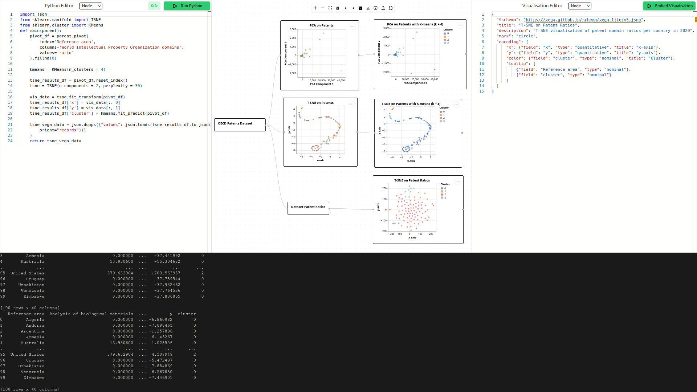

# ExpliVis: A Web Framework for Malleable and Explainable Visualisation



This is a continuation of the [proof-of-concept web framework](https://github.com/simonmhansen/malleable-explainable-webframework) published as a [EuroVis2024 Poster](https://doi.org/10.2312/evp.20241080) with an Honorable Mention Award.

ExpliVis is a highly malleable web framework, based on user-created Charts holding visualisations. Each Chart has its own unique Python and Vega-Lite code, which can be edited and seamlessly executed. 

Charts can have chidren, and pass down their data. This allows for splitting up the data visualisation pipeline into distinct steps, and have visual feedback for each step. 

The malleable setup lets you quickly change code and get visual feedback on its effects, be it changing a hyperparameter or switch from one algorithm to another. The fast feedback makes it easier to understand and explain the results of every step in the data visualisation pipeline.


## Setting up
ExpliVis uses `Svelte` and `node.js`. To setup, first run 
```
npm install .
```
and then launch the server with
```
npm run dev
```
ExpliVis can then be accessed on `localhost:5173`.

## Using the framework
Initial Charts can be created in the top toolbar. 
When a Chart is clicked, its Python code is shown in the Python Editor on the left and its Vega-Lite scheme is shown in the Vega-Lite Editor on the right.

The framework has a dropdown menu in each editor with templates to get you started.

The Vega-Lite schema can have its own data independent of the Python data. If you want to use data from Python, then leave the `"data"` key out in the Vega-Lite schema. The Python code must return a JSON object, which replaces the `"data"` key in the Vega-Lite schema. An example of this can be found in the templates.

If you want no Vega-Lite visualisation, then leave the Vega-Lite code empty.

You can upload your own dataset in JSON format.

Charts can be deleted by selecting the Chart and pressing the `Delete`-key. This can ruin some parent-child-behaviour, so use wisely.

Your setup can be downloaded as a JSON file, and reuploaded at a later point to resume your progress. 

Python code to be used in multiple Charts can be put in the Utility Library, found in the Python Editor drop-down menu. 

The Python code executes each Chart's `main` function defined as:
```python
def main(parent)

    return ...
```
The `parent` variable holds the return value of the parent Chart's `main`-method. 

#### Examples
ExpliVis has two examples in-built. 

The `iris` templates can be used to create a series of visualisations, which run dimensionality reduction and clustering on the Iris dataset and visualise both the low-dimensional embedding and some clustering metrics. 

The `oecd` templates use data from OECD about countries' patents. It can be used to create a series of visulisations, where PCA fail to find a high-dimensional manifold-like structure in the data, but T-SNE manages to uncover it. 

The OECD example requires you to run the `oecd-patents.ipynb` notebook to download the example dataset, and you must manually upload it to ExpliVis using the toolbar-button. All credits goes to OECD for the dataset. 